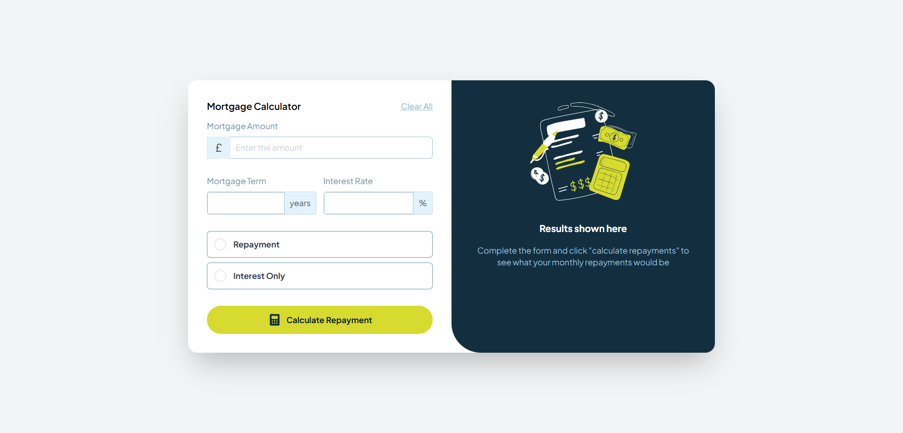

# Frontend Mentor - Mortgage repayment calculator solution

This is a solution to the [Mortgage repayment calculator challenge on Frontend Mentor](https://www.frontendmentor.io/challenges/mortgage-repayment-calculator-Galx1LXK73). Frontend Mentor challenges help you improve your coding skills by building realistic projects.

## Table of contents

- [Overview](#overview)
  - [The challenge](#the-challenge)
  - [Screenshot](#screenshot)
  - [Links](#links)
  - [Built with](#built-with)
- [Author](#author)

**Note: Delete this note and update the table of contents based on what sections you keep.**

## Overview

### The challenge

Users should be able to:

- Input mortgage information and see monthly repayment and total repayment amounts after submitting the form
- See form validation messages if any field is incomplete
- Complete the form only using their keyboard
- View the optimal layout for the interface depending on their device's screen size
- See hover and focus states for all interactive elements on the page

### Screenshot

### Links

- Solution URL: [Click Here!](https://www.frontendmentor.io/solutions/mortgage-repayment-calculator-X9u9e3jLd5)
- Live Site URL: [Click Here!](https://mortgagecalculator-codeuromniscient.netlify.app/)

### Built with

- Semantic HTML5 markup
- Flexbox
- CSS Grid
- Mobile-first workflow
- [React](https://reactjs.org/) - JS library
- [TailwindCss](https://tailwindcss.com/) - For styles
- [TypeScript](https://www.typescriptlang.org/) - JavaScript with syntax for types

## Author

- Website - [Anthony.dev](https://www.your-site.com)
- Frontend Mentor - [Codeur-Omniscient](https://www.frontendmentor.io/profile/Codeur-Omniscient)
